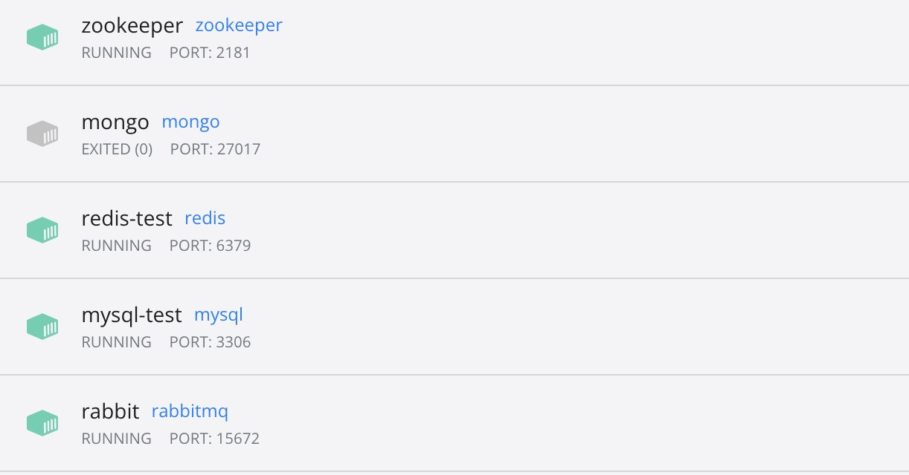

# rpc-bff
rpc服务和高性能bff层

## 完成以下
rpc服务聚合  先安装zookeeper 用 sofa-rpc-node连接  
多级缓存  LRU  redis  
消息队列  先安装RabbitMQ，用amqplib连接     


### 基于grpc的rpc服务实现
grpcdemo目录

### 基于nodejs的高性能bff层
bff目录

### grpc的应用示例
https://github.com/fengnovo/douban


##### sofa-rpc-node
参考 
https://www.wenjiangs.com/doc/dqoczbsk

#### 前置准备，如果不在本机安装mysql这些，就使用docker
1.安装docker  
2.docker安装redis镜像  
3.docker安装mysql镜像 sql表信息：https://github.com/fengnovo/rpc-bff/blob/main/bff/bff/bff_2023-01-09.sql   
4.docker安装zookeeper镜像  
5.docker安装rabbitmq镜像  

##### docker安装和启动zookeeper
参考 
https://betheme.net/qianduan/36331.html?action=onClick   
docker run --name zookeeper -d -p 2181:2181 zookeeper  

##### docker安装和启动 
参考 
https://blog.csdn.net/qq_45502336/article/details/118699251  
docker run -d --hostname my-rabbit --name rabbit -p 15672:15672 -p 5672:5672 rabbitmq




## 启动
```
// 启动user微服务
cd /bff/user
npm install
npm run dev
```

```
// 启动post微服务
cd /bff/post
npm install
npm run dev
```

```
// 启动web的bff层
cd /bff/bff
npm install
npm run dev
```

```
// 启动消息队列
cd /bff/write-logger
npm install
npm run dev
```